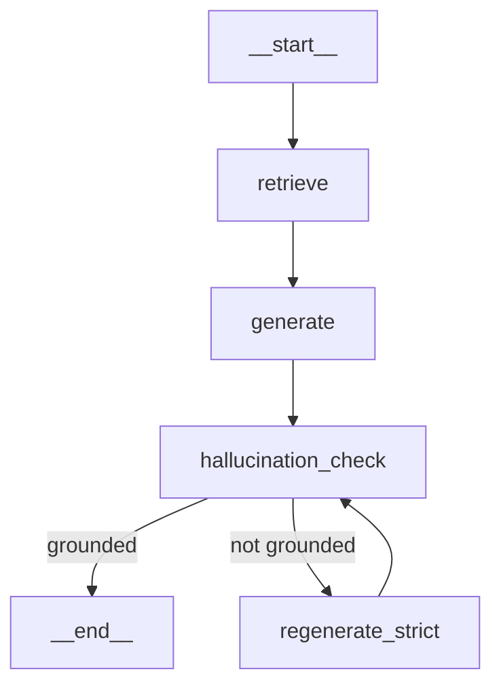

# Justi-Q 🏛️

> 대한민국 형사법 전문 법률 AI 어시스턴트

[](https://www.python.org/downloads/)
[](https://langchain.com/)
[](https://langchain-ai.github.io/langgraph/)

## 개요

Justi-Q는 판례, 법령, 결정문, 법령해석례를 기반으로 형사법 관련 질문에 답변하는 RAG(Retrieval-Augmented Generation) 시스템입니다.

### 주요 기능

- **하이브리드 검색**: Dense (E5) + Sparse (BM25) + RRF 앙상블
- **Cross-Encoder 리랭킹**: 검색 정확도 향상
- **환각 방지 워크플로우**: LangGraph 기반 답변 검증 및 재생성
- **다중 LLM 지원**: OpenAI, OpenRouter, Solar API

## 아키텍처

### LangGraph 워크플로우



| 노드 | 설명 |
|------|------|
| `retrieve` | ChromaDB에서 관련 문서 검색 |
| `generate` | 컨텍스트 기반 답변 생성 |
| `hallucination_check` | 답변의 근거 기반 여부 검증 |
| `regenerate_strict` | 환각 감지 시 보수적 재생성 (1회) |

### 검색 파이프라인

```
Query
  │
  ├─► Dense Search (E5-multilingual-large)
  │         │
  │         ▼
  ├─► Sparse Search (BM25 + Kiwi 형태소분석)
  │         │
  │         ▼
  └────► RRF Fusion ──► Cross-Encoder Rerank ──► Top-K Results
```

## 프로젝트 구조

```
├── src/
│   ├── vectorstore.py          # ChromaDB 벡터 스토어
│   ├── rag_chain.py            # RAG 체인 (LangSmith 트레이싱)
│   ├── langgraph_workflow.py   # LangGraph 워크플로우
│   ├── retriever.py            # 하이브리드 검색 (BM25 + RRF + Reranker)
│   ├── evaluation.py           # RAGAS 평가
│   └── data_loader.py          # 데이터 로더 및 청킹
├── docs/
│   ├── SETUP.md                # 설치 가이드
│   ├── RAGAS_GUIDE.md          # RAGAS 평가 가이드
│   └── RETRIEVAL_EVALUATION.md # Retrieval 평가 가이드
├── scripts/
│   ├── sample_data.py          # 데이터 샘플링
│   └── run_evaluation.py       # 평가 실행
├── app.py                      # Streamlit 웹 앱
├── main.py                     # CLI 인터페이스
├── evaluate_retrieval.py       # Retrieval Hit Rate 평가
└── requirements.txt
```

## 설치

### 1. 의존성 설치

```bash
pip install -r requirements.txt
```

### 2. 환경 변수 설정

```bash
cp .env.example .env
```

```env
# LLM API (하나만 설정)
OPENAI_API_KEY=sk-...
# 또는
OPENROUTER_API_KEY=sk-or-...
# 또는
SOLAR_API_KEY=...

# LangSmith (선택)
LANGCHAIN_API_KEY=lsv2_...
LANGCHAIN_PROJECT=justi-q
```

### 3. 벡터 DB 구축

```bash
python main.py --build
```

## 사용법

### Streamlit 웹 앱

```bash
streamlit run app.py
```

### CLI

```bash
python main.py --query "폭행죄의 처벌 기준은?"
```

### Python API

```python
from src.vectorstore import VectorStore
from src.rag_chain import RAGChain
from src.langgraph_workflow import run_workflow

# 초기화
vs = VectorStore()
rag = RAGChain(vs)

# LangGraph 워크플로우 실행
result = run_workflow(
    question="음주운전 처벌 규정은?",
    vectorstore=vs,
    rag_chain=rag
)

print(result["final"])
```

## 평가

### Retrieval 평가 (Hit Rate)

```bash
# 벡터 검색
python evaluate_retrieval.py --mode vector

# 하이브리드 검색
python evaluate_retrieval.py --mode hybrid

# 전체 비교
python evaluate_retrieval.py --mode all
```

### RAGAS 평가

```bash
python -m src.evaluation --sample-size 50
```

| 메트릭 | 설명 |
|--------|------|
| Faithfulness | 답변이 컨텍스트에 근거하는 정도 |
| Answer Relevancy | 답변이 질문에 적합한 정도 |
| Context Precision | 검색된 컨텍스트의 정확도 |
| Context Recall | 필요한 정보의 검색 비율 |

## 기술 스택

| 구분 | 기술 |
|------|------|
| Embedding | `intfloat/multilingual-e5-large` |
| Vector DB | ChromaDB |
| Sparse Search | BM25 + Kiwi (한국어 형태소 분석) |
| Reranker | `BAAI/bge-reranker-v2-m3` |
| LLM | GPT-4o-mini / Llama 3.3 70B |
| Orchestration | LangGraph |
| Tracing | LangSmith |
| Frontend | Streamlit |

## 라이선스

본 프로젝트는 교육 및 연구 목적으로 제작되었습니다.

## 참고 자료

- [LangChain Documentation](https://python.langchain.com/)
- [LangGraph Documentation](https://langchain-ai.github.io/langgraph/)
- [RAGAS Documentation](https://docs.ragas.io/)
