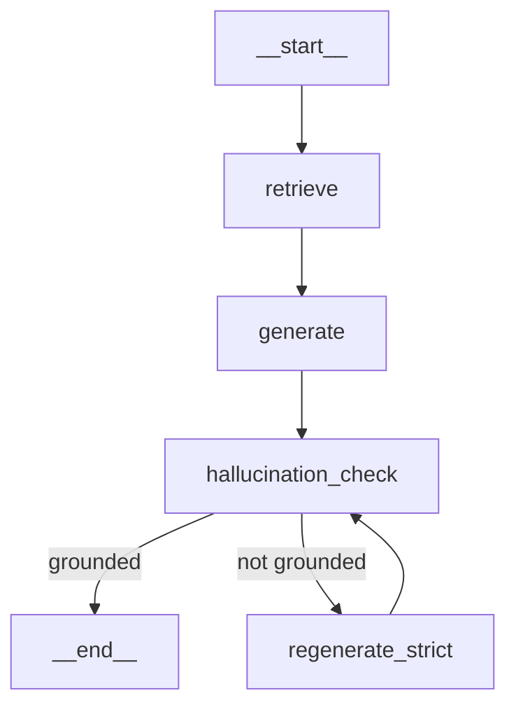

# LangGraph 워크플로우 가이드

## 개요

LangGraph 기반 RAG 워크플로우로, 환각(Hallucination) 방지를 위한 답변 검증 및 재생성 로직을 구현합니다.

## 워크플로우 다이어그램



## 노드 설명

### 1. retrieve

**역할**: 사용자 질문과 관련된 문서를 ChromaDB에서 검색

```python
def retrieve_node(state: GraphState, *, vectorstore: VectorStore) -> GraphState:
    docs = vectorstore.search(question, n_results=n_results, filter_type=filter_type)
    ctx = _format_context(docs)
    return {"documents": docs, "context": ctx}
```

**입력**:
- `question`: 사용자 질문
- `n_results`: 검색할 문서 수 (기본: 5)
- `filter_type`: 문서 타입 필터 (선택)

**출력**:
- `documents`: 검색된 문서 리스트
- `context`: 포맷팅된 컨텍스트 문자열

### 2. generate

**역할**: 검색된 컨텍스트를 기반으로 답변 생성

```python
def generate_node(state: GraphState, *, rag_chain: RAGChain) -> GraphState:
    prompt = f"""
    아래 [컨텍스트]만 근거로 답변하세요.
    - 컨텍스트에 없는 내용은 추측하지 말고 '근거 부족'이라고 말하세요.
    - 가능하면 조문/사건번호를 함께 제시하세요.

    [질문] {question}
    [컨텍스트] {context}
    """
    return {"answer": answer}
```

**입력**:
- `question`: 사용자 질문
- `context`: 포맷팅된 컨텍스트

**출력**:
- `answer`: LLM이 생성한 답변

### 3. hallucination_check

**역할**: 생성된 답변이 컨텍스트에 근거하는지 검증

```python
def hallucination_check_node(state: GraphState, *, rag_chain: RAGChain) -> GraphState:
    judge_prompt = """
    너는 '법률 RAG 답변 검증' 심사관이다.

    판정 기준:
    - 답변의 핵심 주장이 컨텍스트에 명시적으로 뒷받침되는가?
    - 컨텍스트에 없는 조문/형량/사실을 만들어내면 FAIL

    출력: {"grounded": true/false, "issues": [...]}
    """
    return {"grounded": grounded, "issues": issues, "final": final}
```

**입력**:
- `question`: 사용자 질문
- `context`: 포맷팅된 컨텍스트
- `answer`: 생성된 답변

**출력**:
- `grounded`: 근거 기반 여부 (bool)
- `issues`: 발견된 문제점 리스트
- `final`: 최종 답변 (문제 감지 시 경고 포함)

### 4. regenerate_strict

**역할**: 환각 감지 시 보수적으로 답변 재생성 (1회만)

```python
def regenerate_strict_node(state: GraphState, *, rag_chain: RAGChain) -> GraphState:
    strict_prompt = """
    아래 제공된 문서 내용에 **명시적으로 포함된 내용만** 사용해서 답변하라.
    추론, 일반화, 추정은 금지한다.
    근거가 부족하면 반드시 '답변 불가'라고 말하라.
    """
    return {"answer": answer, "retry_count": retry_count + 1}
```

**입력**:
- `question`: 사용자 질문
- `context`: 포맷팅된 컨텍스트
- `retry_count`: 현재 재시도 횟수

**출력**:
- `answer`: 보수적으로 재생성된 답변
- `retry_count`: 증가된 재시도 횟수

## 상태 (State) 정의

```python
class GraphState(TypedDict, total=False):
    # 입력
    question: str
    n_results: int
    filter_type: Optional[str]

    # Retrieval 결과
    documents: List[Dict[str, Any]]
    context: str

    # Generation 결과
    answer: str

    # Hallucination Check 결과
    grounded: bool
    issues: List[str]
    final: str

    # Retry 제어
    retry_count: int
    max_retries: int  # 기본값: 1
```

## 조건 분기 로직

```python
def decide_after_hallucination(state: GraphState) -> str:
    # 근거 기반 답변이면 종료
    if state.get("grounded", False):
        return "end"

    # 재시도 횟수가 남아있으면 재생성
    if state.get("retry_count", 0) < state.get("max_retries", 0):
        return "regenerate_strict"

    # 재시도 소진 시 종료 (경고 포함된 답변 반환)
    return "end"
```

## 사용법

### 기본 사용

```python
from src.vectorstore import VectorStore
from src.rag_chain import RAGChain
from src.langgraph_workflow import run_workflow

# 초기화
vs = VectorStore()
rag = RAGChain(vs)

# 워크플로우 실행
result = run_workflow(
    question="폭행죄의 처벌 기준은?",
    vectorstore=vs,
    rag_chain=rag,
    n_results=5
)

# 결과 확인
print(result["final"])          # 최종 답변
print(result["grounded"])       # 근거 기반 여부
print(result["issues"])         # 발견된 문제점
print(result["retry_count"])    # 재시도 횟수
```

### 커스텀 설정

```python
from src.langgraph_workflow import build_workflow, GraphState

# 워크플로우 빌드
app = build_workflow(vectorstore=vs, rag_chain=rag)

# 커스텀 상태로 실행
state: GraphState = {
    "question": "음주운전 처벌 규정은?",
    "n_results": 10,
    "filter_type": "statute",  # 법령만 검색
    "retry_count": 0,
    "max_retries": 2,  # 재시도 2회까지 허용
}

result = app.invoke(state)
```

## 출력 예시

### 근거 기반 답변 (grounded=True)

```
폭행죄의 처벌 기준은 형법 제260조에 따라 2년 이하의 징역,
500만원 이하의 벌금, 구류 또는 과료에 처합니다.

관련 판례: 대법원 2019도12345 판결에서...
```

### 환각 감지 답변 (grounded=False)

```
폭행죄의 처벌 기준은 형법 제260조에 따라 2년 이하의 징역에 처합니다.

⚠️ 근거 기반 검증에서 문제가 감지되었습니다. 아래 항목을 확인하세요:
- 벌금형에 대한 구체적 금액이 컨텍스트에 명시되지 않음
- 판례 인용 부분의 사건번호 확인 필요
```

## 설계 원칙

### 1. 보수적 재생성 (Conservative Regeneration)
- 환각 감지 시 1회만 재생성
- 재생성 프롬프트는 더 엄격한 제약 조건 적용
- 무한 루프 방지를 위한 `max_retries` 제한

### 2. 투명한 불확실성 표시
- 근거 부족 시 명시적으로 표시
- 검증 실패 시 경고와 함께 원본 답변 제공
- 사용자가 답변의 신뢰도를 판단할 수 있도록 함

### 3. 법률 도메인 특화
- 조문/사건번호 인용 강조
- 법률 용어의 정확성 검증
- 추론/추정 금지

## 관련 파일

```
├── src/
│   ├── langgraph_workflow.py   # 워크플로우 구현
│   ├── rag_chain.py            # RAG 체인 (LLM 호출)
│   └── vectorstore.py          # 벡터 스토어 (검색)
```

## 향후 개선 방향

1. **다단계 검색**: 초기 답변 기반 추가 검색
2. **출처 명시 강화**: 답변 내 문서 참조 자동 삽입
3. **신뢰도 점수**: 답변의 확신도 수치화
4. **멀티턴 대화**: 후속 질문 처리 지원
